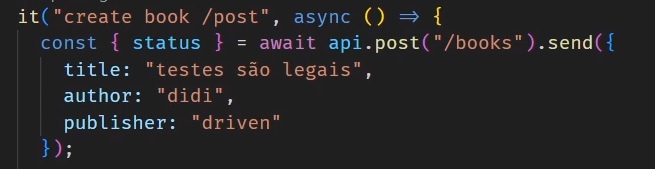
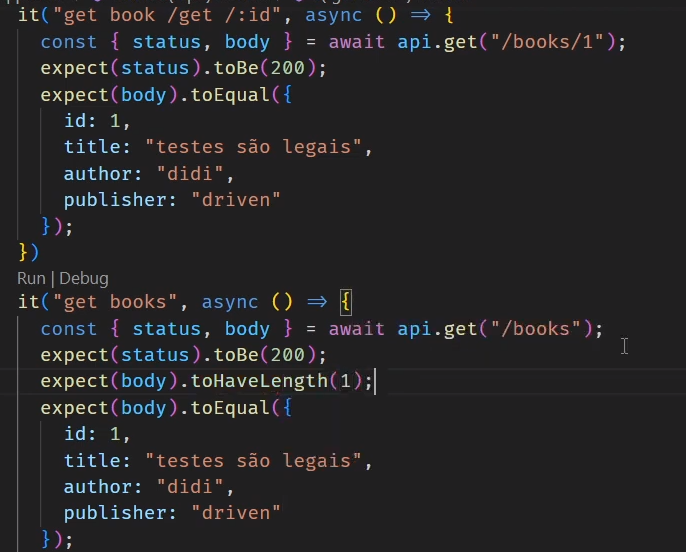

# Aula 1 e 2

# Testes Automatizados

Objetivo Principal: O principal objetivo dos testes automatizados é garantir a qualidade do software, identificando erros, defeitos ou regressões rapidamente, antes que eles atinjam os usuários finais.


## Tipos de Testes Automatizados:

**Testes Unitários:** Avaliam unidades individuais de código, como funções ou métodos, para verificar se funcionam conforme o esperado.
**Testes de Integração:** Verificam a interação entre várias unidades ou componentes do software.
**Testes de Aceitação:** Validam se o software atende aos critérios de aceitação estabelecidos pelos stakeholders.
**Testes de Desempenho:** Medem o desempenho do software sob diferentes condições de carga.
**Testes de Segurança:** Avaliam a segurança do software, identificando vulnerabilidades.
**Testes de Interface de Usuário (UI):** Verificam a funcionalidade da interface do usuário.
**Testes de Regressão**: Garantem que as alterações no código não quebraram funcionalidades existentes.


## Vantagens dos Testes Automatizados:

Eficiência: Os testes automatizados podem ser executados rapidamente e repetidamente, economizando tempo em comparação com testes manuais.
Reprodutibilidade: Os testes produzem resultados consistentes em todas as execuções, reduzindo a variabilidade humana.
Detecção Precoce de Erros: Identificam problemas logo após o desenvolvimento, facilitando correções imediatas.
Documentação Viva: Os testes automatizados servem como documentação viva do comportamento esperado do software.
Ferramentas de Teste Automatizado: Existem diversas ferramentas e frameworks disponíveis para diferentes tipos de testes, como JUnit, Selenium, JIRA, Postman, entre outros.


# Aula 3

**Jest**


npm i -D jest ts-node ts-jest @types/jest typescript


Na pasta "jest.config.ts" add 

        module.exports = {
            preset: "ts-jest",
            testEnvironment: "node",
            moduleDirectories: ["node_modules", "src"],
            transform: {
                ".+\\.ts$": "ts-jest"
            },
            testMathc: ["<rootDir>/testes/*.(test|spec).ts"],
        }


no package.json add

        "scripts": {
            "test": "jest"
        },


**Super Test**

Separar em 
    *app.ts
    *server.ts

npm i -D supertest @types/supertest


### Exemplos 

import app from '../src/app.js';
import supertest from 'supertest';


```javascript
describe("POST /tasks", () => {
    it("given a valid task it should return 201", async () => {
        const body = {
          title: 'Beber agua',
          description: 'Beba, agora!',
        };

        const result = await supertest(app).post("/tasks").send(body);
        const status = result.status;
        
        expect(status).toEqual(201);
    });
});

```
```javascript

describe("POST /tasks", async () => {
    // ...

    it("given an invalid task it should return 422", () => {
        const body = {}; // corpo inválido
        const result = await supertest(app).post("/tasks").send(body);
        const status = result.status;
        expect(status).toEqual(422);
    });
 
    // ...
});

```


```typescript
describe("POST /tasks", () => {
    // ...

    it("given a task with duplicate title it should return 409", async  () => {
        const body = {
          title: 'Beber agua de novo',
          description: 'Beba, agora',
        };

        const firstTry = await supertest(app).post("/tasks").send(body);
        expect(firstTry.status).toEqual(201); // a primeira inserção vai funcionar

        // se tentarmos criar uma task igual, deve retornar 409
        const secondTry = await supertest(app).post("/tasks").send(body);
        expect(secondTry.status).toEqual(409);
    });
});
```

utilizando bd

